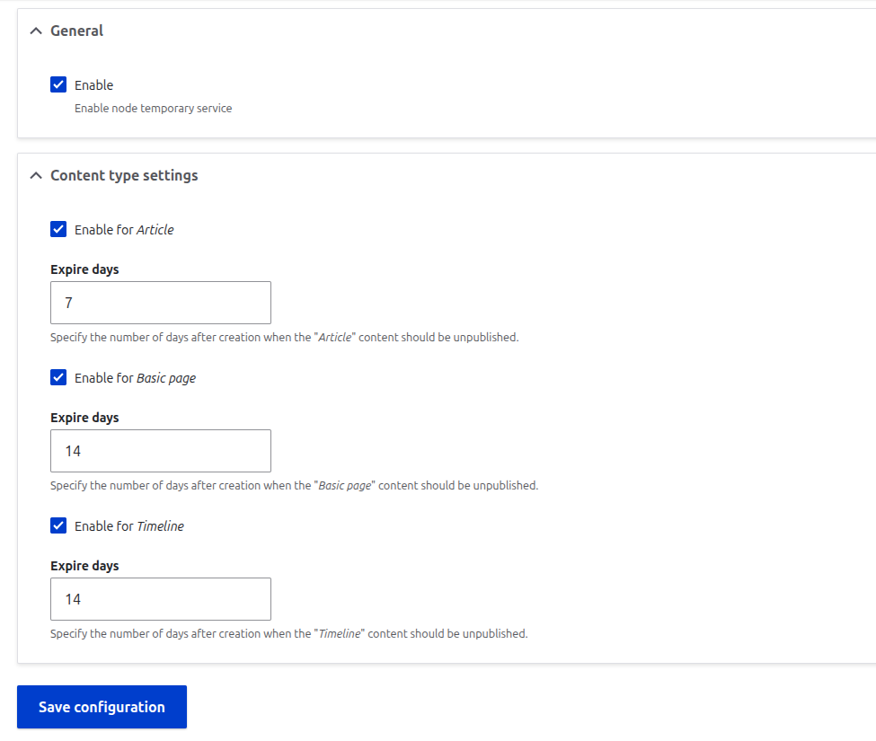
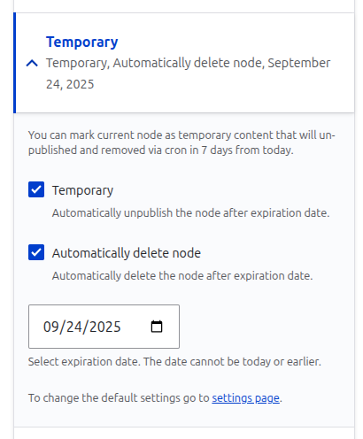
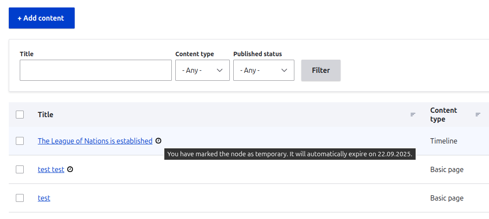

# Module Node Temporary

### Description
Module provide:
- Mark content nodes as temporary
- Set expiration dates
- Auto-unpublish or delete expired content via cron/queue
- Configure per content type + buffer periods
- View expiration details directly in Content Views

Enable the module and navigate to the settings page:

**Configuration → Content authoring → Node temporary settings**

```
admin/config/content/node-temporary
```
Enable the service and configure it for specific node types. You can adjust the expiration period; the minimum allowed is 1 day.

In the node form sidebar, the Temporary section allows you to choose what happens when the expiration date is reached: you can either unpublish the node or remove it completely.

To view all temporary nodes, go to **Structure → Node temporary**:

```
admin/structure/node-temporary
```
On this page you can review all marked nodes and remove their "temporary" mark directly from the list.


### Media

Settings form



Node edit form (advanced section)



Node edit form, message


Content view expiration details



### Permissions
Module provide permissions *access node temporary* and *administer node temporary configuration*.
- administer node temporary configuration: allow to set and update expiration date
- administer node temporary configuration: allow to change default settings for each node type

### Install
Dependencies:
```
dependencies:
- drupal:field
- drupal:node
- drupal:user
- queue_ui:queue_ui
```

Install this module using the standard Drupal module installation process.

### Important

Supports D11+ only.
